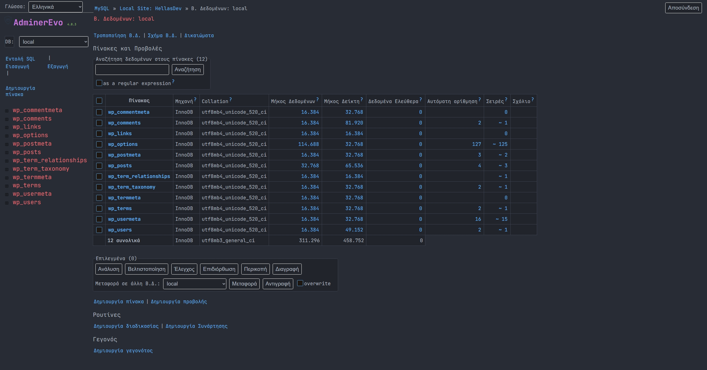

# One Dark Pro Theme for AdminerEvo

A custom dark theme for [Adminer](https://www.adminer.org/), inspired by the popular Atom One Dark Pro color scheme.  
This theme brings a modern, sleek, and highly readable look to your Adminer interface.

## Overview



This project provides a CSS file to style Adminer with a dark, professional aesthetic. Built for users who love the One Dark Pro look, it enhances UI elements like tables, forms, and code blocks with improved contrast and readability. The theme is designed by George Bereveskos (modified by you) and is regularly updated to ensure compatibility.

## Features

- **Modern Dark Colors**: Inspired by Atom's One Dark Pro, featuring a harmonious palette.
- **Enhanced Readability**: Improved typography with JetBrains Mono and Nerd Font support.
- **Responsive Elements**: Smooth transitions, focus states, and well-padded elements.
- **Customizable Design**: Easily edit the CSS to adjust sizing, colors, and other UI elements.

## Installation

1. **Download the CSS File**  
   Clone or download the repository and save the `adminer.css` file.

2. **Integrate with Adminer**  
   Copy the CSS file to the Adminer directory. Modify your Adminer setup to load the custom stylesheet. For example, if you use custom plugins or configuration, update the template to reference:
   ```html
   <link rel="stylesheet" type="text/css" href="path/to/adminer.css">
   ```

3. **Ensure Font Availability**  
   The theme uses JetBrains Mono Nerd Font. Either install this font on your system or adjust the `@font-face` rule in the CSS to use an alternative font.

## Usage

- Open Adminer, and the new theme should be applied automatically when the stylesheet is loaded.
- Adjust the CSS variables if you need different sizing or color tweaks.
- For further customization, modify styles for elements like headers, tables, buttons, and form fields.

## Customization

Feel free to modify the code to suit your needs:
- **Font Adjustments**: Change the font-face or modify the import URL.
- **Color Tweaks**: Update color codes in the CSS to adjust the theme palette.
- **Element Sizing**: Increase or decrease paddings, font sizes, and margins as desired.

## Contributing

Contributions are welcome! If you have suggestions or improvements:
1. Fork the repository.
2. Create a new branch for your modifications.
3. Submit a pull request with detailed information on your changes.

## License

This project is licensed under the MIT License. See the LICENSE file for details.

## Attribution

- Original theme inspired by Atom One Dark Pro.
- Designed by George Bereveskos - Hellas Dev.
- Customizations and updates provided by Borana Mili Selenica (your modifications).

## Contact

For questions or suggestions, please open an issue on this repository or contact the maintainer.

`Enjoy your enhanced Adminer experience with a sleek modern look!`
